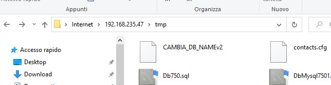
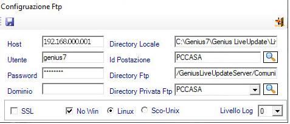
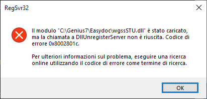
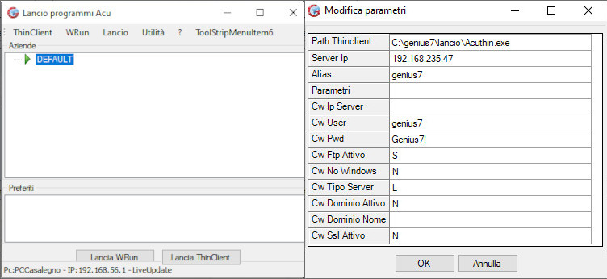

Configuriamo una VM
======================

Macchina di FrontOffice.
Versione di test con USSER e PWD
Su Gorilla trovi tutte le password

CONFIGURAZIONE BASE
--------------------
Per attivare una macchina virtuale, utilizzo come base **Linux RedHat64** e la seguente configurazione

- Sistema
	- Scheda madre
		- Memoria 2048MB
		- Solo Disco fisso
	- Processore
		- 2 Core
- Archiviazione
	- Rimuoverere controllo IDE
- Rete
	- Connessa a: Scheda con bridge
	- Avanzate Tipo di scheda:  Virtio-net
	
Quindi posso avviare.

Al ogni avvio della MV viene richiesta la password di decriptazione creata appositamente per la partizione
_/u/usr_ (dati e applicativi aziendali criptati): 

	SYSDAT123

Chiave da utilizzare per il cliente come secondo accesso al lock della partizione /u
PIVA+CODICE CODI

Cercare l'indirizzo Ip della macchina con 
ifconfig
ip

Creare una configurazione per CTOPER sulla macchina.
MOdificare il file cblconfi sulla home di della folder genius
/u/usr/genius7

Una volta configurato il file per CTOPER ho configurato anche il controllo per NAGIOS.
Per accedere e verificare (lo faccio tramite browser) uso
http//IP_DELLA_MACCHINA/nagios
USR nagiosadmin
PSW nagiosadmin

Ora dobbiamo configurare nagios perchè funzioni.
Quindi ricerchiamo all'interno della WM la cartella Nagios.
Nagios funziona e viene configurato tramite due file presenti nella cartella 
/usr/local/nagios/etc/objects
i file in teressati sono 
$localhost.cfg
$commands.cfg

Quando applico la modifica al file localhost.cfg devo riavviare il demone di Nagios con il comando
$systemctl restart nagios

Quando modifico il file localhost devo impostare come prima voce l'address nel define host
con l'ip della macchina
Quindi posso aggiungere nuovi plugin andando a scaricarli d

Eseguire il backup del server del cliente
-----------------------------------------

Quando un cliente ha un server personale, bisogna mettere al sicuro i suoi dati.
Se la macchina è un server windows, dobbiamo per prima cosa installare **Cobian Reflector** ed andiamo ad impostare l'esecuzione del backup di tutta la macchina sul server NAS del cliente.

Quando imposto il backup dal cliente eseguo il bkp del disco .vmdk della macchina virtuale. Su Cobian nelle configurazione Generale del Task, devo assicurarmi che la voce _Usa copie shadow del volume_ sia flaggato.
La posizione standard del file della macchina virtuale su dispositivo windows è in _C://VM/*.vmdk_

Nel caso il cliente lo richieda, posso impostare il backup anche della parte utente del server facendo attenzione che non sia ridondante la copia della VM.
Per fare questo devo installare su tutti i pc client del cliente una versione di Cobian che backuppa direttamente sul NAS.

### Backup alternativi a Cobian	

- Tramite Cron per quel che riguarda i database con lo script Dumpdb.sh presente nella cartella /u/usr/genius7/batch/ 
- La procedura manuale viene eseguito dall'hotel in fase di chiusura della giornata lavorativa seguendo un Task prefissato di passaggi tra questo un backup interno di Genius7 (script pre-configurato). 

INFO VARIE
-Se chiudo la connessione che il client ha in atto con il server (quindi con la VM in funzione) automaticamenbte il client si chiude (ci vuole un po di tempo)
Per chiudure la sessione devo cercare il Pid tramite
$ps ax|grep runcbl

INFO SU Genius7
Per sapere quale release è installato in 
$Genius7/standard/arc
trovo il file RELEASE.TXT

Installiamo il client di Genius7
----------------------
Per installare il Client Genius7 sul computer windows del cliente dobbiamo scaricare il pacchetto _GeniusLiveUpdater_ dalla macchina virtuale. Questo significa che prima di tutto dobbiamo aver installato la VM.
Il file che ci interessa si trova nella cartella _/tmp/_ ed il file in questione è *Setup Genius LiveUpdate1.0.zip*

Come primo passaggio conviene copiarlo sul computer host e il metodo piu veloce è accedere tramite FTP alla macchina virtuale.
Da _Esplora Risorse_ inserisco nella barra degli indirizzi l'url ftp della VM ftp://IPDELLAMACCHINA/tmp

copio il file sul desktop e lo decomprimo.
Quindi eseguo il file _setup.exe_ contenuto nella cartella. Andrà a creare un collegamento chiamato _Genius LiveUpdater.exe_ che sarà da eseguire (icona di una frecca verde).

### Prima esecuzione

Alla prima esecuzione ci verrà proposta la compilazione della configurazione[^1]. Andrà compilata come da immagine seguente

- Nel campo Host va inserito l'indirizzo della macchina
- Nel campo User l'utente per accedere alla macchina
- Nel campo Password la password dell'utente
- Nei campi Id Postazione e Directory Privata FTP va inserito lo stesso valore, relativo alla postazione che si installa, tutto in maiuscolo.
- Nella barra inferiore flaggare l'opzione _No Win_ poichè si tratta di una VM (alla quale il client si collega) basata su Linux, e spuntare tra le voci che appaiono _Linux_, quindi salvare (pulsante in alto a sx).

### Seconda esecuzione

Eseguiamo nuovamente _Genius LiveUpdater.exe_ e ci verrà proposta una schermata che visualizza i programmi che saranno da li a breve installati.

Cliccando sul pulsante verde Play in alto a sx possiamo dare il via all'installazione, che come nella maggior parte dei programmi Windows sarà un susseguirsi di _Avanti ->_ lasciando invariati i parametri di installazione proposti.
I programmi in sequenza installati sono quelli presenti nell'immagine sopra, che possono essere visualizzati all'interno della cartella _C:\Genius7\Genius LiveUpdate\LiveUpdate_

- AcurunNet4.0.exe
- Crysview_GenPdf41.exe
- EasydocClient1.4.3.exe
- SetupEdocvb6Cryrep.exe

Durante la fase di installazione si aprirà una shell di dos dove vengono registrate tutte le Dll necessarie a Genius7 per funzionare. Per ogni Dll installata viene richesto una conferma di installazione.
E plausibile la presenza di un errore come nell'esempio che segue 

che però non invalida il processo di installazione.
Al termine dell'installazione posso chiudere tutto il programma _Genius LiveUpdater.exe_ di aggiornamento e procedere con la configurazione del client.

### Configurazione del client Genius7

La configurazione del client è piuttosto basilare almeno inizialmente. Una volta lanciato il programma dal'icona _SysHotel Genius_ si apre una finestra di lancio di Acu. 
Cliccare con il tasto dx del mouse sulla voce Default e selezionare dal menu contestuale la voce _Abilita Modifiche_.
Nella finestra che si apre, inserire nel campo Server IP l'indirizzo della VM alla quale appoggiare il sistema.
Quindi lanciare il programma con il pulsante _LanciaThinClient_

I dati per accedere al sistema come operatore sono gli stessi che si utilizzano per il CRM. Quindi inserire[^2] il codice azienda per procedere all'apertura. 

In questa fare il programma è pronto al funzionamento.

Il passaggio successivo sarebbe quello di vedere la configurazione delle stampe e dei dispositivi da associare.
Quest'ultimi possono essere:

- il Pos
- il lettore di smart card Cherry
- la tavoletta per la firma digitale
- la pistola per la lettura dei codici a barre
- lo scanner per la lettura OCR dei documenti di identità o delle ricevute.

I demoni di AcuCobol
--------------------
Per poter funzionare correttamente AcuCobol e di conseguenza Genius7, necessitano della presenza di due demoni.

Questi demoni sono visualizzabili direttamente nella macchina richiamando come utente _root_ il servizio apposito

	servsiges
	
Il demone **acushare** serve per far girare l'interfaccia del pms, uno per ogni singolo ambiente. L'interfaccia è eseguita dal software **acuthin** che viene collegato al demone tramite il servizio **acurcl**
	1) acuthin@GENIUS.service: active
	2) dbmaker@MONEY.service: failed
	3) acuthin@CONTAB61.service: active
	4) acuthin@CONTAB64.service: active
	5) colspe@COLSPE.service: active
	6) nagios.service: active
	7) ossec.service: failed

La visualizzazione dei prosessi in atto con questi 5 servizi attivi, è visualizzabile chiamando da terminale il comando `ps ax|grep acu` che mostra il seguente risultato

	[root@clientevm bin]# ps ax|grep acu
	1547 ?        S      0:00 /home/acucorp/acucobol1020/bin/acurcl -start -e /home/acucorp/acucobol1020/acu11020.log -n 11020 -t 7
	7109 ?        Ss     0:00 postgres: autovacuum launcher process
	7278 ?        S      0:00 /home/acucorp/acucobol922/bin/acurcl -start -e /home/acucorp/acucobol922/acu11922.log -n 11922 -t 7
	8863 ?        S      0:00 /home/acucorp/acucobol1020/bin/acushare -start
	9688 pts/0    S+     0:00 grep --color=auto acu
	26704 ?        S      0:00 /home/acucorp/acucobol1020/bin/acurcl -start -e 	/home/acucorp/acucobol1020/acu5632.log -n 5632 -t 7
	[root@clientevm bin]# ps axw|grep acu
	1547 ?        S      0:00 /home/acucorp/acucobol1020/bin/acurcl -start -e /home/acucorp/acucobol1020/acu11020.log -n 11020 -t 7
	7109 ?        Ss     0:00 postgres: autovacuum launcher process
	7278 ?        S      0:00 /home/acucorp/acucobol922/bin/acurcl -start -e /home/acucorp/acucobol922/acu11922.log -n 11922 -t 7
	8863 ?        S      0:00 /home/acucorp/acucobol1020/bin/acushare -start
	10533 pts/0    S+     0:00 grep --color=auto acu
	26704 ?        S      0:00 /home/acucorp/acucobol1020/bin/acurcl -start -e /home/acucorp/acucobol1020/acu5632.log -n 5632 -t 7

Mentre Nagios ed Ossec non sono in uso, il demone **colspe** è quello che mantiene in vita i servizi di interrogazione delle API dei servizi esterni di prenotazione online.S

Sempre tramite il servizio _servsiges_ si possono avviare o stoppare i singoli demoni tramite l'apposito menu. Puo capitare che un demone non riesca a ripartire o a chiudersi ed uno dei motivi puo essere la non corretta compilazione del file _/etc/hosts_.

[^1]:Per avviare nuovamente il programma di Update e di configurazione bisogna rinominare la cartella sul computer client Windows _C:\Genius7\Genius LiveUpdate\LiveUpdate_ in _C:\Genius7\Genius LiveUpdate\OLDLiveUpdate_

[^2]: In tutto il programma ed in tutto il crm il comando _F6_ permette di attivare la ricerca per campo input nel quale ci troviamo.